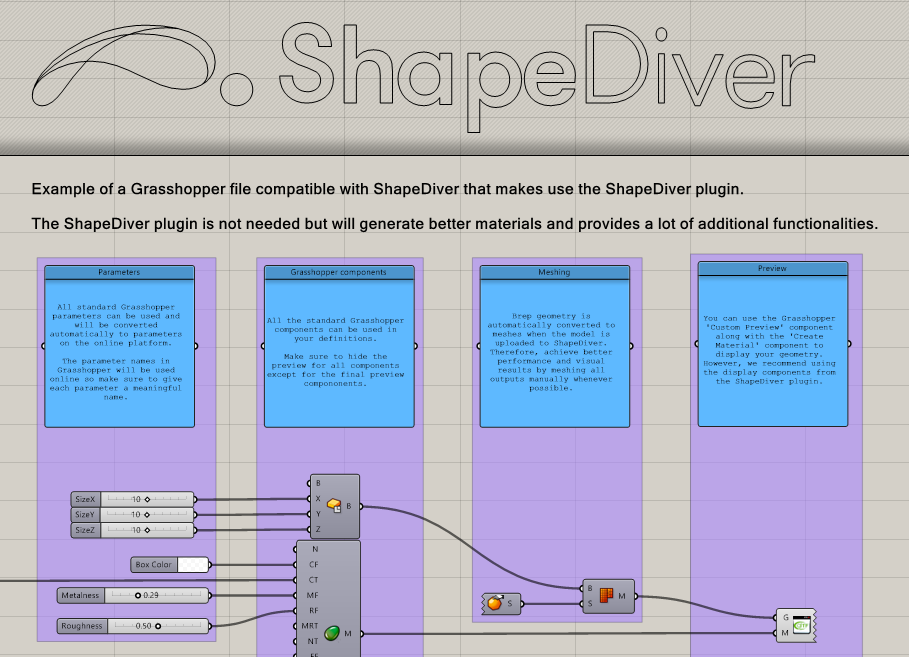

# 👋 Welcome to the ShapeDiver tutorial library!

## Introduction

In this library, you will find Grasshopper definitions demonstrating various ShapeDiver features. Before you get started, here are some links that you might find helpful:

- ❓ [What is ShapeDiver?](https://shapediver.com/)
- 👤 [Create an account](https://www.shapediver.com/app/register) to the platform and start exploring.
- 🦗 [Download](https://www.food4rhino.com/en/app/shapediver) the latest version of the ShapeDiver plugin for Grasshopper.
- ⬆️ [Start uploading](https://www.shapediver.com/app/m/upload) Grasshopper definitions to your account and generate online applications instantly!

## How to use the tutorials

Each definition of this library doubles as a tutorial with in-depth explanations of the various steps to get a specific plugin functionality up and running:

Browse the various sections to read a description of what each tutorial covers, and a hint about the tutorial level:

 ★ ☆ ☆ : Beginner

 ★ ★ ☆ : Intermediate
 
 ★ ★ ★ : Expert 

> 💡 Use the navigation on the left to browse sections.

The definitions are regularly updated to the latest version of the ShapeDiver plugin and ready to be uploaded to the ShapeDiver platform, but you can of course use them to get started and start developing your own designs.

Let's get started!